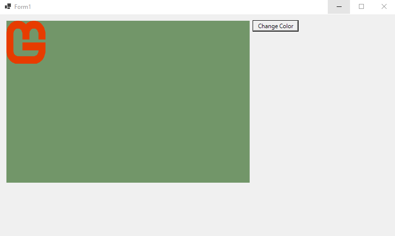
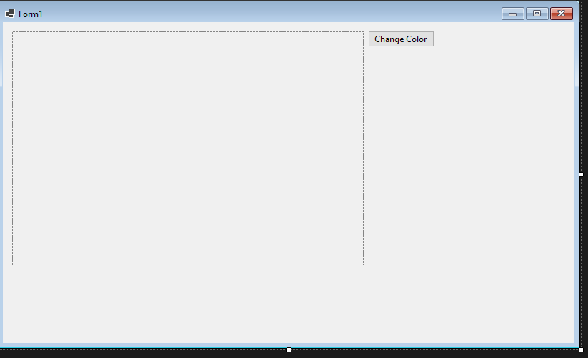

# **Embed MonoGame in Winform**

I'm not the originator of this code. The bassis of this code was originally posted in the XNA Creators Club forum. I don't remember the original poster. The forum is gone now so I can't credit the original poster. Works in XNA 3, XNA 4 and MonoGame.

This sample code shows how to embed MonoGame into a Winform and have interactions with both form and MonoGame. I've tried to explain the basics of the code below but it's best to just download the project and look at it yourself. Below is what it looks like running. The green box with the MonoGame logo is the embedded MonoGame. The button allows user to tell the MonoGame app to change the color of the background.




## **Code explanation.**


1. Create an MonoGame DX project.

2. Create a winform with a PictureBox control and button. (see below).

    

3. Add the code to the the winform should look like sample below.

    Private Game1 variable was added. A public method to return the picturebox handle. A method to set the Game1 variable. The form close event with exit the application. The button click event will interact with the Game1 variable.
    ```
    namespace WinformMonoGame
    {
        public partial class Form1 : Form
        {
            private Game1 gameObject;
            public Form1()
            {
                InitializeComponent();
            }

            public IntPtr GetDrawSurface()
            {
                return pictureBox1.Handle;
            }

            public void SetGameObject(Game1 game)
            {
                gameObject = game;
            }

            private void Form1_FormClosed(object sender, FormClosedEventArgs e)
            {
                Application.Exit();
            }

            private void button1_Click(object sender, EventArgs e)
            {
                gameObject.ChangeBackgroundColor();
            }
        }
    }

    ```

4. Modification to the Game1.cls

    Create drawSurface variable. Create new constructor for the Game1 class.

    ```
        private IntPtr drawSurface;

        public Game1(IntPtr drawSurface):this()
        {
            this.drawSurface = drawSurface;
            graphics.PreparingDeviceSettings += new EventHandler<PreparingDeviceSettingsEventArgs>(graphics_PreparingDeviceSettings);
            System.Windows.Forms.Control.FromHandle((this.Window.Handle)).VisibleChanged += new EventHandler(Game1_VisibleChanged);

            changeColor = true;
            random = new Random();
        }

    ```

    Create two event handlers to handle events in the new constructor.

    ```
        void graphics_PreparingDeviceSettings(object sender, PreparingDeviceSettingsEventArgs e)
        {
            e.GraphicsDeviceInformation.PresentationParameters.DeviceWindowHandle = drawSurface;
        }

        private void Game1_VisibleChanged(object sender, EventArgs e)
        {
            if (System.Windows.Forms.Control.FromHandle((this.Window.Handle)).Visible == true)
                System.Windows.Forms.Control.FromHandle((this.Window.Handle)).Visible = false;
        }

    ```

    Create public method so winform can interact with Game1.
    ```
        public void ChangeBackgroundColor()
        {
            changeColor = true;
        }    
    ```

5. Changes to Program.cs

    Create instance of Form1. Use new Game1 constructor. Pass Game1 to form.
    ```
        static void Main()
        {
            Form1 form = new Form1();
            form.Show();
            using (var game = new Game1(form.GetDrawSurface()))
            {
                form.SetGameObject(game);
                game.Run();
            }
        }    
    ```


